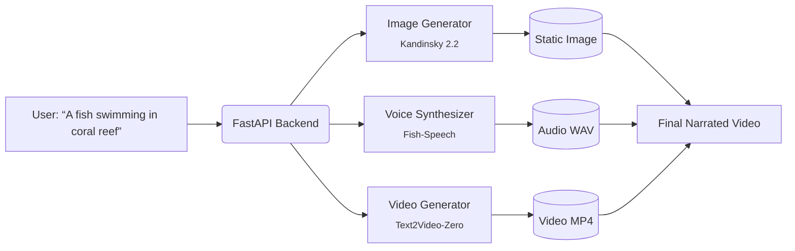

# 🐟 Fish Video Generator

> **Text-to-Video Generation with Voiceover — All in One Open-Source Pipeline**

Generate high-quality, narrated videos from a single text prompt — no GPU required.  
Powered by open-source AI models: **Kandinsky 2.2** (image), **Fish-Speech** (voice), and **Text2Video-Zero** (video).

[](LICENSE)
[](https://www.python.org/)
[](https://www.docker.com/)

---

## 🌟 Features

- ✅ **Pure CPU inference** – runs on machines with **8GB+ RAM**, no GPU needed  
- ✅ **End-to-end pipeline**: Text → Image → Voice → Video  
- ✅ **Long video support** (5–10+ minutes) via segment stitching  
- ✅ **Modular microservices architecture** (easy to extend or replace components)  
- ✅ **Dockerized & production-ready**  
- ✅ **Fully open-source** with permissive licenses (Apache 2.0 / MIT)

---

## 🧠 Architecture Overview



### Core Services

| Service | Model | Port | Role |
|--------|-------|------|------|
| `backend` | FastAPI + RQ | 8000 | Orchestrates the full pipeline |
| `image-gen` | Kandinsky 2.2 | 8001 | Generates background image from text |
| `fish-speech` | Fish-Speech v1.4 | 7860 | Synthesizes natural-sounding voice |
| `video-gen` | Text2Video-Zero | 8002 | Renders animated video with audio |

---

## 🚀 Quick Start

### Prerequisites

- Docker & Docker Compose
- At least **8GB RAM** (16GB recommended for smoother experience)
- ~10 GB free disk space (for model weights)

### Run with Docker Compose

```bash
git clone https://github.com/BlackGenerator/fish-video-generator.git
cd fish-video-generator

# Start all services (CPU mode)
docker-compose up --build
```

> 💡 First run will download ~4GB of model weights (one-time only).

### Generate Your First Video

Send a POST request to the backend:

```bash
curl -X POST http://localhost:8000/generate \
  -H "Content-Type: application/json" \
  -d '{"prompt": "A golden retriever playing in autumn leaves"}'
```

The response includes a URL to your generated video:
```json
{
  "video_url": "/static/outputs/video_abc123.mp4"
}
```

Access it at: `http://localhost:8000/static/outputs/video_abc123.mp4`

---

## 📂 Project Structure

```
fish-video-generator/
├── backend/               # Orchestration API & task queue
├── services/
│   ├── image-gen/         # Kandinsky 2.2 image generator
│   ├── video-gen/         # Text2Video-Zero video renderer
│   └── ...                # (fish-speech runs as external container)
├── static/outputs/        # Generated videos stored here
├── docker-compose.yml     # CPU version
├── docker-compose.gpu.yml # GPU-accelerated version (optional)
└── README.md
```

---

## ⚙️ Configuration

All services are configured via environment variables in `docker-compose.yml`.  
Key options:

| Variable | Default | Description |
|--------|--------|-------------|
| `VIDEO_DURATION` | `30` | Output video length (seconds) |
| `AUDIO_LANG` | `en` | Voice language (`en`, `zh`, `ja`, etc.) |
| `IMAGE_SIZE` | `768` | Kandinsky output resolution |

> 🔧 Edit `docker-compose.yml` to customize.

---

## 📦 Model Licenses

| Component | Model | License |
|----------|-------|--------|
| Image | [kandinsky-community/kandinsky-2-2](https://huggingface.co/kandinsky-community) | Apache 2.0 |
| Voice | [fishaudio/fish-speech](https://github.com/fishaudio/fish-speech) | MIT |
| Video | [cerspense/zeroscope_v2_576w](https://huggingface.co/cerspense/zeroscope_v2_576w) | CC BY-NC-SA 4.0 |

> ⚠️ **Note**: Zeroscope (Text2Video-Zero) is **non-commercial**. For commercial use, replace `video-gen` with a commercial-friendly alternative.

---

## 🛠️ Development

### Build individual services

```bash
# Rebuild image generator
docker build -t fish-video-generator/image-gen ./services/image-gen

# Run backend locally (for dev)
cd backend
pip install -r requirements.txt
uvicorn main:app --reload
```

### Run with GPU acceleration (optional)

```bash
# Requires NVIDIA Docker runtime
docker-compose -f docker-compose.gpu.yml up --build
```

---

## 🤝 Contributing

Contributions are welcome! Please open an issue or PR for:
- New voice models
- Commercial-friendly video generators
- Performance optimizations (e.g., ONNX, quantization)
- Web UI frontend

---

## 📜 License

This project is licensed under the **Apache License 2.0** – see [LICENSE](LICENSE) for details.

> Note: While the *code* is Apache 2.0, some *models* have different licenses (see above). Ensure compliance with model licenses in your use case.

---

## 🙏 Acknowledgements

- [Kandinsky 2.2](https://github.com/ai-forever/Kandinsky-2) by AI Forever
- [Fish-Speech](https://github.com/fishaudio/fish-speech) by Fish Audio
- [Text2Video-Zero](https://github.com/Picsart-AI-Research/Text2Video-Zero) by Picsart AI Research
- [RQ](https://python-rq.org/) for lightweight task queuing

---

> 🐟 **Made with ❤️ for creators, educators, and indie developers.**  
> No cloud APIs. No paywalls. Just open-source AI.